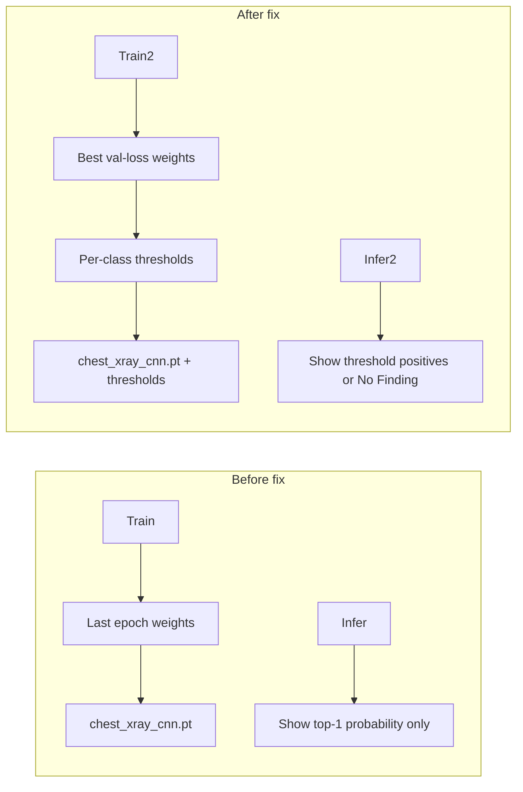

# Ashna Chest X-ray Handoff Plan

## Context

- **Nauman:** Applied fixes in [`train_chest_xray.py`](train_chest_xray.py) locally — pushed in the same commit as this document.
- **Ashna:** Owns the chest X-ray branch and has the NIH ChestX-ray14 dataset on her machine.
- **Problem that was fixed:** The model looked like it was predicting the wrong disease because (1) inference always showed **raw top-1 class** (often a common label like Infiltration), and (2) training saved **best weights** to `chest_xray_cnn_best.pt` but evaluated/saved **`chest_xray_cnn.pt` from the last epoch** (worse after early stopping).



---

## Part 1 — Nauman: push the fix (do this first)

From the project root:

```powershell
git add train_chest_xray.py CHEST_XRAY_HANDOFF.md
git commit -m "Fix chest X-ray inference: reload best checkpoint and use threshold-based predictions"
git push origin main
```

Tell Ashna the commit message so she knows she has the right version after `git pull`.

**What changed (for Ashna's reference):**

| Area | Change in code |
|------|----------------|
| After training | Reloads `outputs/chest_xray_cnn_best.pt` before threshold tuning, test metrics, previews, and final save |
| Checkpoints | `optimized_thresholds` stored inside `chest_xray_cnn.pt` and `chest_xray_cnn_best.pt` |
| Inference display | New `_format_clinical_prediction()` — shows diseases that pass **per-class thresholds**, or `No Finding` if none pass |
| Missing checkpoint | `_resolve_checkpoint_path()` falls back to `chest_xray_cnn_best.pt` if `chest_xray_cnn.pt` is missing |
| Previews / CSV | Grad-CAM and `predicted_label` use threshold-based labels, not raw top-1 |

Debug logging (`debug-9f5fc4.log`) is still in the file temporarily; Ashna can ignore it. Remove in a follow-up after she confirms predictions look correct.

---

## Part 2 — Ashna: get the code

```powershell
cd path\to\Multimodal-Clinical-Diagnosis-System-using-Custom-Deep-Learning-Architectures
git pull origin main
pip install -r requirements.txt
```

She should confirm [`train_chest_xray.py`](train_chest_xray.py) contains `_format_clinical_prediction` and `reloaded_best` (search in file).

---

## Part 3 — Ashna: dataset layout

NIH ChestX-ray14 must be extracted so this path works (default `--data-root`):

```
%USERPROFILE%\Downloads\archive\
├── Data_Entry_2017.csv
├── images_001\images\*.png
├── images_002\images\*.png
└── ...
```

If her folder is elsewhere, pass `--data-root "D:\path\to\archive"`.

---

## Part 4 — Ashna: training workflow (two stages)

### Stage A — Sanity run (verify pipeline, ~30–60 min depending on GPU)

```powershell
python train_chest_xray.py --data-root %USERPROFILE%\Downloads\archive --max-images 500 --epochs 10 --batch-size 8
```

**She should see in terminal:**
- `Restored best-validation checkpoint from outputs\chest_xray_cnn_best.pt` (after training)
- `Optimized per-class thresholds` listing values **not all 0.500**
- Final test metrics block (micro/macro F1)

**Expected files:**

```
outputs/
├── chest_xray_cnn.pt          # best weights + optimized_thresholds
├── chest_xray_cnn_best.pt
├── chest_xray_classes.json
├── test_metrics.json
└── test_previews/               # Grad-CAM panels
```

### Stage B — Full training (only if Stage A looks OK)

```powershell
python train_chest_xray.py --data-root %USERPROFILE%\Downloads\archive --max-images 0 --epochs 100 --batch-size 8
```

README targets: micro F1 ~0.7–0.8 on full NIH data ([`README.md`](README.md) lines 96–101). Requires GPU; reduce `--batch-size` to 4 if OOM.

---

## Part 5 — Ashna: inference on new X-rays

1. Place PNG/JPG files in [`input/`](input/) (repo already has sample images).
2. Run:

```powershell
python train_chest_xray.py --inference-only --checkpoint outputs/chest_xray_cnn.pt --external-test-folder input
```

**How to read output (this is the main behavior change):**

| Terminal output | Meaning |
|-----------------|--------|
| `Effusion (0.62), Pneumonia (0.55)` | Both passed their **optimized thresholds** — real multi-label prediction |
| `No Finding (low confidence)` | Nothing passed threshold; model is uncertain |
| `No Finding (weak signal: Infiltration 0.31)` | Nothing passed threshold; Infiltration is only the highest raw score |

**Artifacts:**
- Previews: `outputs/external_test_previews/*.png`
- CSV: `outputs/external_test_previews/external_test_results.csv` — `predicted_label` column now uses threshold logic

### Optional: evaluate against labeled external images

If she has a CSV with `filename` + `Finding Labels`:

```powershell
python train_chest_xray.py --inference-only --checkpoint outputs/chest_xray_cnn.pt --external-test-folder input --external-labels-csv path\to\labels.csv
```

Metrics: `outputs/external_test_previews/external_test_metrics.json`

---

## Part 6 — Ashna: success checklist

Before reporting "chest branch done" to the team:

- [ ] `outputs/test_metrics.json` exists with `optimized_thresholds` and reasonable `macro_f1` / `micro_f1`
- [ ] `outputs/chest_xray_cnn.pt` loads without error in `--inference-only`
- [ ] Inference does **not** always print the same single disease for every image
- [ ] Grad-CAM previews saved under `outputs/test_previews/` or `external_test_previews/`
- [ ] She shares `test_metrics.json` + 1–2 preview PNGs with Nauman for a quick review

---

## Part 7 — After Ashna confirms (follow-up for Nauman)

1. Remove temporary debug instrumentation from [`train_chest_xray.py`](train_chest_xray.py) (`_debug_log`, `debug-9f5fc4.log`)
2. Optionally add a short **"Chest X-ray handoff"** section to [`README.md`](README.md) documenting threshold-based prediction wording (currently README still describes architecture but not the fixed inference behavior)

---

## Message you can send Ashna (copy-paste)

> Hi Ashna — I pushed a fix for the chest X-ray wrong-prediction issue. Please `git pull origin main`.
>
> **What changed:** inference now uses per-class thresholds (not raw top-1), and training saves/evaluates the **best** checkpoint, not the last epoch.
>
> **Your steps:**
> 1. `pip install -r requirements.txt`
> 2. Quick train: `python train_chest_xray.py --data-root <your NIH archive path> --max-images 500 --epochs 10 --batch-size 8`
> 3. Inference: `python train_chest_xray.py --inference-only --checkpoint outputs/chest_xray_cnn.pt --external-test-folder input`
> 4. Check `outputs/test_metrics.json` and share preview PNGs if anything still looks wrong.
>
> Full details are in [`CHEST_XRAY_HANDOFF.md`](CHEST_XRAY_HANDOFF.md) and the latest `train_chest_xray.py`.
