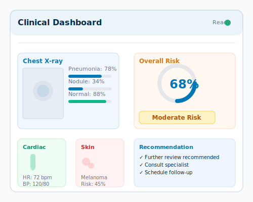
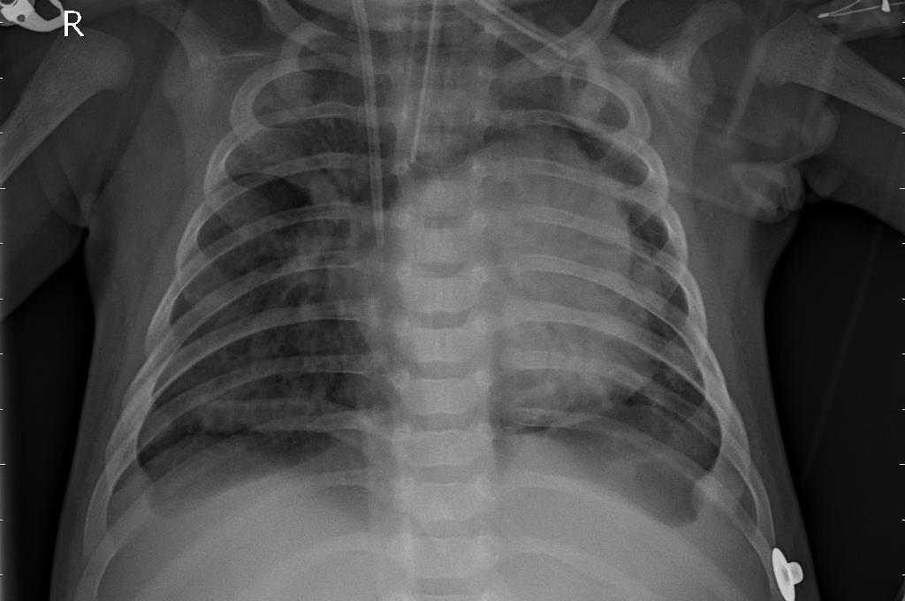
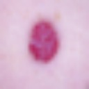
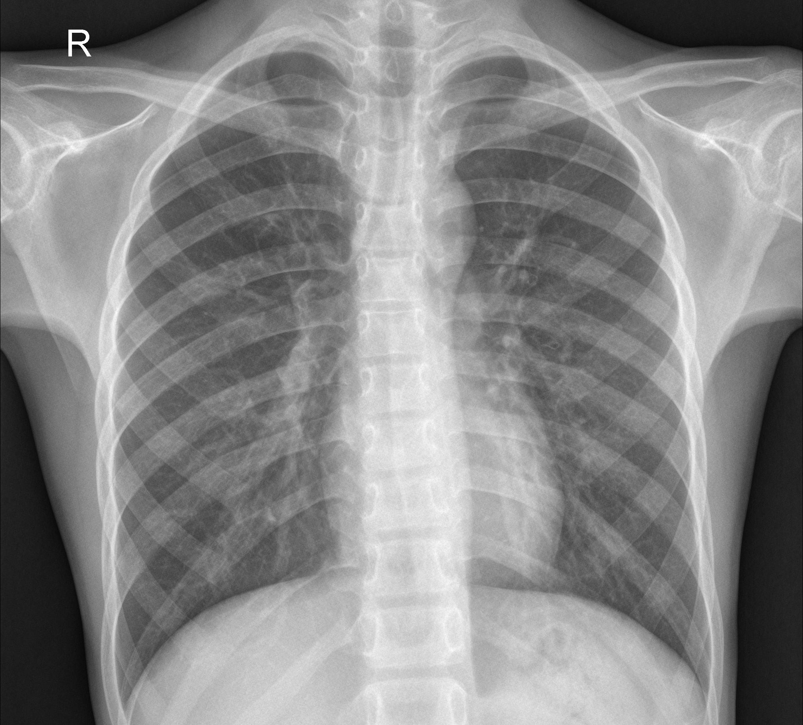

# FusionNet Clinical Dashboard — 8-Slide Presentation

**Project:** Multimodal Clinical Diagnosis System using Custom Deep Learning Architectures  
**Timing:** ~10–12 min · Focus on problem, data, method, results, demo — not theory  
**Disclaimer:** Research/education only — not for clinical use.

**Project root (use this prefix for all paths below):**  
`c:\Users\nauma\Desktop\GlobalHealth\Multimodal-Clinical-Diagnosis-System-using-Custom-Deep-Learning-Architectures\`

---

## Image index — all assets by slide

| Slide | Insert | Relative path | What it shows |
|-------|--------|---------------|---------------|
| **1** | Logo (optional) | `webapp/static/assets/logo.svg` | FusionNet logo |
| **1** | Hero / overview (pick one) | `webapp/static/assets/dashboard-illustration.svg` | Dashboard illustration (built-in asset) |
| **1** | Overview screenshot | **CAPTURE** → save as `presentation_assets/slide01_overview.png` | Web app **Overview** tab at `http://127.0.0.1:8000` |
| **2** | Pipeline diagram | **CREATE in PowerPoint** (no file) | Boxes: inputs → 3 models → fusion → dashboard |
| **3** | X-ray sample | `test_samples/xray/pneumonia.jpeg` | Pediatric chest X-ray (pneumonia class) |
| **3** | Skin sample | `test_samples/skin/lesion_mel.jpg` | Melanoma-class skin lesion (HMNIST export) |
| **3** | Heart inputs | **CAPTURE** → `presentation_assets/slide03_heart_form.png` | **Diagnosis** tab — cardiac vitals form section |
| **4** | Normal X-ray (preprocessing) | `test_samples/xray/normal.jpeg` | Raw/normal test X-ray before model resize |
| **4** | Normal + pneumonia pair | `test_samples/xray/normal.jpeg` + `test_samples/xray/pneumonia.jpeg` | Side-by-side “input examples” |
| **5** | Architecture / UI | **CAPTURE** → `presentation_assets/slide05_models_tab.png` | **Models** tab (`how-it-works` section) in web app |
| **5** | Feature icons (optional) | `webapp/static/assets/feature-diagnostic.svg` | “Structured findings” icon from home page |
| **6** | Grad-CAM correct | `XRay-Pneumonia/outputs/xray/test_previews/preview_4_pred_PNEUMONIA_true_PNEUMONIA.png` | True pneumonia · pred pneumonia · heatmap on lungs |
| **6** | Grad-CAM error | `XRay-Pneumonia/outputs/xray/test_previews/preview_2_pred_PNEUMONIA_true_NORMAL.png` | True normal · pred pneumonia (false positive) |
| **6** | Extra Grad-CAM (optional) | `XRay-Pneumonia/outputs/xray/test_previews/preview_5_pred_PNEUMONIA_true_PNEUMONIA.png` | Another true-positive pneumonia example |
| **7** | Metrics chart | **CREATE in PowerPoint** | Bar chart: X-ray 82% · Skin 55% · Heart 87% |
| **7** | Fusion output | **CAPTURE** → `presentation_assets/slide07_fusion_results.png` | Results panel: fusion risk bar + recommendation |
| **8** | Full demo output | **CAPTURE** → `presentation_assets/slide08_demo_full.png` | X-ray + skin uploads, Grad-CAM, probability bars, fusion |
| **8** | Live demo inputs | `test_samples/xray/pneumonia.jpeg` + `test_samples/skin/lesion_mel.jpg` | Files to upload during live demo |

### Grad-CAM preview folder (all available PNGs)

```
XRay-Pneumonia/outputs/xray/test_previews/
├── preview_1_pred_NORMAL_true_NORMAL.png
├── preview_2_pred_PNEUMONIA_true_NORMAL.png      ← false positive (use on slide 6)
├── preview_3_pred_NORMAL_true_NORMAL.png
├── preview_4_pred_PNEUMONIA_true_PNEUMONIA.png   ← true positive (use on slide 6)
├── preview_5_pred_PNEUMONIA_true_PNEUMONIA.png
└── preview_6_pred_PNEUMONIA_true_PNEUMONIA.png
```

### X-ray test samples (all available)

```
test_samples/xray/
├── normal.jpeg
├── normal_02.jpeg … normal_04.jpeg
├── pneumonia.jpeg
├── pneumonia_02.jpeg … pneumonia_04.jpeg
└── pneumonia_bacterial.jpeg
```

### Skin test samples (examples)

```
test_samples/skin/
├── lesion_mel.jpg          ← demo / slide 3
├── lesion_nv.jpg
├── lesion_bcc.jpg
└── … (one file per class, 14 total)
```

### Screenshots you must capture yourself

Create folder: `presentation_assets/` (anywhere; suggested at project root).

| Filename | When to capture | URL / action |
|----------|-----------------|--------------|
| `slide01_overview.png` | Slide 1 | Open `/` → **Overview** tab → full page screenshot |
| `slide03_heart_form.png` | Slide 3 | **Diagnosis** tab → scroll to cardiac vitals form |
| `slide05_models_tab.png` | Slide 5 | **Models** tab |
| `slide07_fusion_results.png` | Slide 7 | Run analysis → crop **fusion summary** + risk bar |
| `slide08_demo_full.png` | Slide 8 | Run analysis with pneumonia + mel skin → full results panel |

---

## Slide 1 — Title & Overview (~45 sec)

### Title
**FusionNet-Scratch**  
Multimodal Clinical Diagnosis System

### Subtitle
Custom deep learning · Chest X-ray · Skin · Heart · Web dashboard

### On-slide (3 bullets)
- **3 modalities** fused into one clinical review workspace
- **Custom CNNs + tabular MLP** — trained and deployed on **CPU**
- **FastAPI web app** with Grad-CAM explainability

### Insert images

| Priority | File | Full path |
|----------|------|-----------|
| **Option A — logo** | `webapp/static/assets/logo.svg` | `...\webapp\static\assets\logo.svg` |
| **Option B — illustration** | `webapp/static/assets/dashboard-illustration.svg` | `...\webapp\static\assets\dashboard-illustration.svg` |
| **Option C — screenshot (best)** | `presentation_assets/slide01_overview.png` | Capture from browser (see index above) |

Preview in Markdown (illustration):
```markdown

```

### Speaker note
"One sentence: we built an end-to-end system that takes imaging and vitals and returns a structured risk summary with interpretable heatmaps."

---

## Slide 2 — Problem Statement & Objectives (~1.5 min)

### Headline
**Why multimodal clinical support?**

### Bullets
- Real triage uses **multiple signal types** — radiology, dermatology, cardiac vitals — often reviewed in **separate tools**
- **Fragmentation** slows decision support and makes holistic risk hard to see at a glance
- **Objective:** Train modality-specific models and **fuse outputs** into one dashboard
- **Success criteria:** working checkpoints, test metrics, live inference, **Grad-CAM** for CNN transparency
- **Non-goal:** replace clinicians or claim medical-device readiness

### Insert images

| Priority | File | Notes |
|----------|------|-------|
| **Recommended** | **Draw in slide tool** | Pipeline: `Patient inputs → [X-ray CNN \| Skin CNN \| Heart MLP] → Fusion → Risk + recommendation` |
| Optional background | `webapp/static/assets/feature-diagnostic.svg` | Small icon beside “Objective” bullet |

No photo required on this slide — diagram is enough.

### Speaker note
"We frame this as decision support for teaching and prototyping, not autonomous diagnosis."

---

## Slide 3 — Datasets (~1.5 min)

### Headline
**Three public datasets, three input types**

| Modality | Source | Train / Test | Classes |
|----------|--------|--------------|---------|
| **Chest X-ray** | Kaggle Chest X-ray Pneumonia | **5,218** / **624** | NORMAL · PNEUMONIA |
| **Skin lesion** | HAM10000 MNIST CSV | **10,015** images (held-out test split) | **7** types (akiec, bcc, bkl, df, nv, mel, vasc) |
| **Heart disease** | UCI-style `heart.csv` | **918** patients (80/20 split) | No disease · Heart disease |

### Bullets
- X-ray: **pediatric** cohort (ages 1–5) — important limitation
- Skin: **28×28 RGB** exports — fast to train, limited detail
- Heart: **11 clinical features** (age, BP, cholesterol, chest pain type, etc.)

### Insert images (3-column layout)

| Column | Relative path | Full path |
|--------|---------------|-----------|
| **X-ray** | `test_samples/xray/pneumonia.jpeg` | `...\test_samples\xray\pneumonia.jpeg` |
| **Skin** | `test_samples/skin/lesion_mel.jpg` | `...\test_samples\skin\lesion_mel.jpg` |
| **Heart** | `presentation_assets/slide03_heart_form.png` | Screenshot of vitals form on **Diagnosis** tab |

Markdown embeds (X-ray + skin):
```markdown


```

**Dataset files (reference only, do not paste on slide):**
- X-ray data: `XRay-Pneumonia/chest_xray/chest_xray/train/` and `.../test/`
- Skin CSV: `Heart&SkinCancer/Skin Cancer Data set/hmnist_28_28_RGB.csv`
- Heart CSV: `Heart&SkinCancer/Heart Data set/heart.csv`

---

## Slide 4 — Preprocessing & Training Setup (~1.5 min)

### Headline
**From raw data to trainable tensors**

### X-ray
- Grayscale → 3-channel RGB · resize **128×128** · normalize to [-1, 1]
- Train augmentations: flip, rotation, color jitter, random erasing
- **Class-weighted** cross-entropy (pneumonia ~3× more common in train)
- Split: official Kaggle **train** → 85% train / 15% val; evaluate on official **test** (624)

### Skin
- Same CNN input pipeline; upscaled from **28×28**
- Class weights for **severe imbalance** (nv dominates)

### Heart
- **OneHotEncoder** (categorical) + **RobustScaler** (numeric)
- Preprocessor saved as `Heart&SkinCancer/outputs/heart/heart_preprocessor.joblib`

### Insert images

| Priority | Relative path | Full path | Caption on slide |
|----------|---------------|-----------|------------------|
| **Left panel** | `test_samples/xray/normal.jpeg` | `...\test_samples\xray\normal.jpeg` | "Raw chest X-ray (test sample)" |
| **Right panel** | `test_samples/xray/pneumonia.jpeg` | `...\test_samples\xray\pneumonia.jpeg` | "Same pipeline → 128×128 → normalized tensor" |

Optional second row — class balance (use counts as text, no image):
- Train: `XRay-Pneumonia/chest_xray/chest_xray/train/NORMAL/` (1342) vs `.../PNEUMONIA/` (3876)

```markdown


```

---

## Slide 5 — Methodology & Models (~1.5 min)

### Headline
**Custom architectures + late fusion**

| Component | Design | Output |
|-----------|--------|--------|
| **ChestPneumoniaCNN** | 4× (Conv3×3 → BN → ReLU → pool) → global pool → MLP | Binary softmax + **Grad-CAM** |
| **SkinLesionCNN** | **Same skeleton** as X-ray CNN | 7-class softmax + **Grad-CAM** |
| **HeartMLP** | 64 → 64 → **32-d embedding** → 2-class head | Disease probability |
| **Fusion** (`webapp/model_hub.py`) | Rule-based late fusion on confidences | **Low / moderate / high** risk + text recommendation |

### Bullets
- Trained with **Adam**, cross-entropy, early stopping on val loss
- All checkpoints loaded by **ModelHub** → single `/api/predict` endpoint
- Frontend: probability bars, fusion meter, live Grad-CAM overlay

### Insert images

| Priority | File | Full path |
|----------|------|-----------|
| **Primary** | `presentation_assets/slide05_models_tab.png` | Screenshot — **Models** tab in web app |
| **Optional icons** | `webapp/static/assets/feature-diagnostic.svg` | `...\webapp\static\assets\feature-diagnostic.svg` |
| **Optional icons** | `webapp/static/assets/feature-fast.svg` | CPU / fast inference icon |
| **Code reference (small)** | `webapp/model_hub.py` | Mention on slide, do not screenshot whole file |

Checkpoint locations (speaker reference):
- `XRay-Pneumonia/outputs/xray/xray_cnn.pt`
- `Heart&SkinCancer/outputs/skin/skin_cnn.pt`
- `Heart&SkinCancer/outputs/heart/heart_mlp.pt`

---

## Slide 6 — Results: Chest X-ray & Grad-CAM (~1.5 min)

### Headline
**X-ray test performance (624 images)**

| Metric | Value |
|--------|-------|
| Accuracy | **82.1%** |
| Macro F1 | **0.78** |
| PNEUMONIA recall | **98.5%** |
| NORMAL recall | **54.7%** |

### Confusion matrix (say verbally)
- **106** normal cases called pneumonia (false positives)
- **6** pneumonia cases missed (false negatives)
- Model is **screening-biased** toward flagging pneumonia

### Insert images (required — side by side)

| Panel | Relative path | Full path |
|-------|---------------|-----------|
| **Left — correct + explainable** | `XRay-Pneumonia/outputs/xray/test_previews/preview_4_pred_PNEUMONIA_true_PNEUMONIA.png` | `...\XRay-Pneumonia\outputs\xray\test_previews\preview_4_pred_PNEUMONIA_true_PNEUMONIA.png` |
| **Right — failure case** | `XRay-Pneumonia/outputs/xray/test_previews/preview_2_pred_PNEUMONIA_true_NORMAL.png` | `...\XRay-Pneumonia\outputs\xray\test_previews\preview_2_pred_PNEUMONIA_true_NORMAL.png` |

**Slide caption:** Left: Grad-CAM on true pneumonia · Right: false positive on normal case

```markdown


```

**Metrics source:** `XRay-Pneumonia/outputs/xray/metrics.json`  
**Detailed report:** `XRay-Pneumonia/outputs/xray/evaluation_report.json`

---

## Slide 7 — Results: Skin, Heart & Fusion (~1.5 min)

### Headline
**Complementary modalities & fused risk**

| Model | Accuracy | Macro F1 / F1 | Insight |
|-------|----------|---------------|---------|
| **Skin** | **55.4%** | **0.42** macro F1 | Hard 7-class on low-res input; mel recall ~73% |
| **Heart** | **87.0%** | **0.88** F1 | Strongest single model; driven by chest pain, angina, ST slope |
| **Fusion** | N/A | Rule-based score | Combines available modalities → unified triage message |

### Fusion logic (one line)
Positive/high-risk signals from each modality feed a **mean risk score** → low (<0.4) · moderate · high (≥0.7)

### Insert images

| Priority | File | Full path | Notes |
|----------|------|-----------|-------|
| **Chart** | Create in PowerPoint | — | Bars: **82% · 55% · 87%** (X-ray, Skin, Heart) |
| **Fusion screenshot** | `presentation_assets/slide07_fusion_results.png` | Capture after running demo | Risk level + recommendation + notes |
| **Optional skin input** | `test_samples/skin/lesion_nv.jpg` | `...\test_samples\skin\lesion_nv.jpg` | Show benign vs mel if comparing classes |

**Metrics sources:**
- Skin: `Heart&SkinCancer/outputs/skin/metrics.json`
- Heart: `Heart&SkinCancer/outputs/heart/metrics.json`

### Speaker note
"Skin is the weakest link — expected with 28×28. Heart adds strong structured signal. Fusion gives one place to read combined urgency."

---

## Slide 8 — Demo, Conclusion & Future Work (~2 min)

### Live demo checklist (60–90 sec)

1. Open `http://127.0.0.1:8000` → **Diagnosis**
2. Upload these files:

| Input | Relative path | Full path |
|-------|---------------|-----------|
| Chest X-ray | `test_samples/xray/pneumonia.jpeg` | `...\test_samples\xray\pneumonia.jpeg` |
| Skin lesion | `test_samples/skin/lesion_mel.jpg` | `...\test_samples\skin\lesion_mel.jpg` |

3. Click **Run analysis** → point to Grad-CAM, probability charts, fusion risk

### Insert images (backup if live demo fails)

| Priority | File | What to show |
|----------|------|--------------|
| **Main** | `presentation_assets/slide08_demo_full.png` | Full results: X-ray + skin + heart + Grad-CAM + fusion |
| **Inset** | `test_samples/xray/pneumonia.jpeg` | "Input we uploaded" |
| **Inset** | Live Grad-CAM from web app OR `preview_5_pred_PNEUMONIA_true_PNEUMONIA.png` | "Model attention overlay" |

```markdown


```

### Conclusion (3 bullets)
- Delivered **train → infer → fuse → web UI** pipeline on CPU
- **Grad-CAM** makes CNN decisions inspectable for reviewers
- Honest limits: pediatric X-ray, pneumonia bias, low-res skin

### Future work (2 bullets)
- Adult X-ray dataset + threshold tuning for balanced sensitivity/specificity
- Learned fusion + dermatology-grade images; prospective clinical validation

### Closing
"Thank you — happy to run the demo again or share the repo."

---

## Master asset table (copy into PowerPoint “Insert picture”)

| # | Relative path from project root |
|---|----------------------------------|
| 1 | `webapp/static/assets/logo.svg` |
| 2 | `webapp/static/assets/dashboard-illustration.svg` |
| 3 | `webapp/static/assets/feature-diagnostic.svg` |
| 4 | `test_samples/xray/pneumonia.jpeg` |
| 5 | `test_samples/xray/normal.jpeg` |
| 6 | `test_samples/skin/lesion_mel.jpg` |
| 7 | `test_samples/skin/lesion_nv.jpg` |
| 8 | `XRay-Pneumonia/outputs/xray/test_previews/preview_4_pred_PNEUMONIA_true_PNEUMONIA.png` |
| 9 | `XRay-Pneumonia/outputs/xray/test_previews/preview_2_pred_PNEUMONIA_true_NORMAL.png` |
| 10 | `XRay-Pneumonia/outputs/xray/test_previews/preview_5_pred_PNEUMONIA_true_PNEUMONIA.png` |
| 11 | `presentation_assets/slide01_overview.png` *(capture)* |
| 12 | `presentation_assets/slide03_heart_form.png` *(capture)* |
| 13 | `presentation_assets/slide05_models_tab.png` *(capture)* |
| 14 | `presentation_assets/slide07_fusion_results.png` *(capture)* |
| 15 | `presentation_assets/slide08_demo_full.png` *(capture)* |

**Start server for captures:**  
`uvicorn webapp.backend:app --host 127.0.0.1 --port 8000`

---

## Timing (8 slides · ~11 min)

| Slide | Topic | Time |
|-------|-------|------|
| 1 | Title & overview | 0:45 |
| 2 | Problem & objectives | 1:30 |
| 3 | Datasets | 1:30 |
| 4 | Preprocessing | 1:30 |
| 5 | Methodology | 1:30 |
| 6 | X-ray + Grad-CAM results | 1:30 |
| 7 | Skin, heart, fusion | 1:30 |
| 8 | Demo + conclusion | 2:00 |

---

## Skip in presentation (instructor guidance)

- Literature review · CNN/ResNet history · Grad-CAM math · line-by-line code
